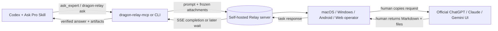

# oracle-relay 🧿 — Human-in-the-loop Oracle workflow

English | [简体中文](README.zh-CN.md)

<p align="center">
  
</p>

<p align="center">
  <a href="https://github.com/DragonFSKY/oracle-relay"></a>
  
  <a href="LICENSE"></a>
</p>

This GitHub fork is the source of truth for Dragon Relay. Build and run it from the default `main` branch; it is not published through the former upstream npm package.

This project is a modified fork of [steipete/oracle](https://github.com/steipete/oracle). The Relay edition exists to reduce the risk that browser automation against an official AI website triggers anti-automation controls, account restrictions, or account suspension. Instead of letting Oracle click and submit through ChatGPT, Claude, or Gemini automatically, a human reviews the prepared prompt and files, submits them in the official client, and returns the result through Relay. This changes the interaction path; it does not guarantee that a provider will never restrict an account, so operators must still follow the provider's terms and security guidance.

Oracle bundles your prompt and files so another AI can answer with real context. It speaks GPT-5.5 Pro (default), GPT-5.5, GPT-5.4 Pro, GPT-5.4, GPT-5.1 Pro, GPT-5.1 Codex (API-only), GPT-5.1, GPT-5.2, Gemini 3.1 Pro, Gemini 3.5 Flash, Gemini 3.1 Flash-Lite, Claude Sonnet 4.6, Claude Opus 4.1, and more—and it can ask one or multiple models in a single run. Upstream-compatible API and browser code remains available, but the supported workflow of `main` is the explicit manual Relay path described below.

## Dragon Relay fork (`main`)

The `main` branch is a self-maintained, human-in-the-loop Oracle workflow. Compared with the original model/API and browser-oriented client, this fork adds:

- a durable Relay server plus asynchronous `dragon-relay ask` / one-shot `dragon-relay wait` commands;
- a blocking two-tool MCP surface (`ask_expert` and `await_expert`) for Codex and other MCP clients;
- native macOS, Windows, and Android operator clients for reviewing prompts, copying request files, and returning answers or attachments;
- persisted System / Simplified Chinese / English operator UI language choices, generated from one reviewed JSON catalog;
- task-scoped loopback delivery for MCP responses, with authenticated public Relay upload as the fallback;
- resumable, verified response attachments, restart-safe sessions, operator notifications, and cross-device task ownership;
- three Codex Skills: `ask-pro`, `ask-pro-repomix`, and `ask-pro-zip`, covering routing, deterministic code bundles, raw ZIP bundles, prompt validation, and bounded review cycles.

### How the manual Relay works



The Relay server is a durable mailbox, not an AI proxy: it stores tasks and attachments, separates producer and operator credentials, streams task state over authenticated SSE, and accepts the human-returned response. It never logs into ChatGPT, clicks a browser, or calls a model API. The operator chooses an official AI client and remains in control of what is submitted. For MCP calls on the same machine, return attachments can use a task-scoped authenticated loopback receiver; unavailable or interrupted loopback delivery falls back to the public Relay upload path.

### Install the CLI and MCP server

Node 24+ and pnpm 10 are required. Build directly from this branch so the local commands match the bundled Skills:

```bash
git clone https://github.com/DragonFSKY/oracle-relay.git
cd oracle-relay
corepack enable
pnpm install --frozen-lockfile
pnpm build
pnpm link --global

oracle --version
dragon-relay --help
dragon-relay-mcp --help
```

Configure secrets only in the process environment or a machine-local secret store. Do not put real values in this repository, shell history, `AGENTS.md`, or committed config files:

```bash
export ORACLE_RELAY_URL="https://relay.example.com"
export ORACLE_RELAY_TOKEN="<producer-token>"
```

Add the blocking Relay MCP to Codex:

```bash
codex mcp add dragon_relay -- "$(command -v dragon-relay-mcp)"
```

The MCP process inherits `ORACLE_RELAY_URL` and `ORACLE_RELAY_TOKEN` from its environment. Give long-running expert calls a sufficiently long tool timeout; see [docs/mcp.md](docs/mcp.md).

### Install the Codex Skills

The three Skills are versioned with this branch. Copy them into the user Skills directory, replacing matching files from an older local copy if needed:

```bash
mkdir -p ~/.codex/skills
mkdir -p ~/.codex/skills/ask-pro ~/.codex/skills/ask-pro-repomix ~/.codex/skills/ask-pro-zip
cp -R skills/ask-pro/. ~/.codex/skills/ask-pro/
cp -R skills/ask-pro-repomix/. ~/.codex/skills/ask-pro-repomix/
cp -R skills/ask-pro-zip/. ~/.codex/skills/ask-pro-zip/
```

Restart Codex after installation. Ask for `askpro`, `ask pro`, `ask Oracle`, or `问 Oracle` to use the router; request `ask-pro-repomix` for a text code bundle or `ask-pro-zip` when the expert must receive original files, images, PDFs, binaries, fixtures, or exact directory structure. The workflow prefers the long-blocking Relay MCP and uses a single recoverable asynchronous CLI submission only when MCP is unavailable before task creation.

For project-level enforcement, copy the Ask Pro trigger and transport rules from this repository's [AGENTS.md](AGENTS.md) into the target project's `AGENTS.md`. Keep credentials out of those instructions.

### Self-host the Relay server

Use a Linux host with Docker Compose, persistent disk, and an HTTPS reverse proxy. Generate separate random producer and operator tokens, then save them only on the server:

```bash
sudo install -d -m 700 /etc/oracle-relay
sudo install -d -o 1000 -g 1000 -m 700 /var/lib/oracle-relay
sudoedit /etc/oracle-relay/relay.env
sudo chmod 600 /etc/oracle-relay/relay.env
```

The machine-local `/etc/oracle-relay/relay.env` should contain:

```dotenv
ORACLE_RELAY_PRODUCER_TOKEN=<random-producer-token>
ORACLE_RELAY_OPERATOR_TOKEN=<different-random-operator-token>
ORACLE_RELAY_HOST=0.0.0.0
ORACLE_RELAY_PORT=19476
ORACLE_RELAY_DATA_DIR=/data
ORACLE_RELAY_MAX_BODY_BYTES=268435456
ORACLE_RELAY_MAX_ATTACHMENT_BYTES=0
ORACLE_RELAY_MAX_TASK_BYTES=0
ORACLE_RELAY_TERMINAL_RETENTION_MS=86400000
```

Build and start the service from `main`:

```bash
corepack enable
pnpm install --frozen-lockfile
pnpm build
docker compose -f deploy/relay/compose.yaml build relay
docker compose -f deploy/relay/compose.yaml up -d relay
docker compose -f deploy/relay/compose.yaml ps relay
curl --fail http://127.0.0.1:19476/health
```

The Compose service exposes only `127.0.0.1:19476`, drops Linux capabilities, uses a read-only root filesystem, persists tasks under `/var/lib/oracle-relay`, and restarts automatically. Terminate TLS in Nginx or another trusted reverse proxy; adapt [deploy/relay/nginx-location.conf.example](deploy/relay/nginx-location.conf.example) inside the HTTPS virtual host. Keep request buffering enabled for chunk uploads and response buffering disabled for SSE. Do not expose the loopback Node port directly to the internet.

After DNS and HTTPS are ready, producers use `ORACLE_RELAY_URL=https://relay.example.com` with the producer token. Human operator clients use the same HTTPS URL with the separate operator token. Back up or prune `/var/lib/oracle-relay` according to your retention policy; prompts and attachments are readable by the Relay host and are not end-to-end encrypted. Full deployment, protocol, client build, and security details are in [docs/relay.md](docs/relay.md).

### GitLab CI/CD

The included [`.gitlab-ci.yml`](.gitlab-ci.yml) is ready for the `main` branch:

- verify TypeScript formatting, lint, types, tests, build output, and tracked-file secret patterns;
- package `oracle-relay-codex-skills.tar.gz` with all three Ask Pro Skills;
- build and push commit/branch-tagged Relay images to the GitLab Container Registry;
- publish credential-free `oracle-relay-*` Windows, Android, and optional macOS build artifacts;
- expose a serialized manual production deployment for `main` and Git tags.

For the manual deploy job, configure these in **GitLab → Settings → CI/CD → Variables**, never in the repository:

| Variable                                  | Purpose                                                            |
| ----------------------------------------- | ------------------------------------------------------------------ |
| `RELAY_DEPLOY_HOST` / `RELAY_DEPLOY_USER` | SSH deployment target                                              |
| `RELAY_DEPLOY_PORT`                       | Optional SSH port; defaults to `22`                                |
| `RELAY_DEPLOY_PATH`                       | Optional remote Compose directory; defaults to `/opt/oracle-relay` |
| `RELAY_ENVIRONMENT_URL`                   | Public HTTPS Relay URL shown by GitLab                             |
| `RELAY_SSH_PRIVATE_KEY`                   | Protected **file-type** SSH key variable                           |
| `RELAY_SSH_KNOWN_HOSTS`                   | Protected **file-type** pinned host-key variable                   |

The deployment host must already have Docker Compose, registry pull access, and `/etc/oracle-relay/relay.env`. The job copies only the Compose definition, pulls the immutable commit image, and replaces the Relay container; it never uploads operator or producer tokens. Client artifacts intentionally contain no production credentials. Build native operator apps locally with environment-provided settings as described in [docs/relay.md](docs/relay.md).

The `build:relay-image` job uses Docker-in-Docker, so a self-managed GitLab runner must permit its Docker service (normally a privileged Docker executor). If that is not acceptable for your runner, replace this job with a rootless BuildKit/Kaniko equivalent while keeping the same immutable image tags and dotenv artifact contract.

Protect the `main` branch before enabling production variables. Mark deploy credentials as **protected** (and masked where GitLab permits it), keep deployment manual, and rotate both Relay tokens plus the deploy key if a runner or operator device is lost.

## Setting up (macOS Browser Mode)

Browser mode lets you use GPT-5.5 Pro without any API keys — it automates your Chrome browser directly.

### First-time login

Run this once to create Oracle's private automation profile and log into ChatGPT. This profile is separate from your normal Chrome profile. The browser will stay open so you can complete the login:

```bash
oracle --engine browser --browser-manual-login \
  --browser-keep-browser --browser-input-timeout 120000 \
  -p "HI"
```

### Subsequent runs

Once logged in, the automation profile is saved. Use this for all future runs:

```bash
oracle --engine browser --browser-manual-login \
  --browser-auto-reattach-delay 5s \
  --browser-auto-reattach-interval 3s \
  --browser-auto-reattach-timeout 60s \
  -p "your prompt"
```

> **Why these flags?**
>
> - `--browser-manual-login` — Skips macOS Keychain cookie access (avoids repeated permission popups)
> - `--browser-auto-reattach-*` — Reconnects when ChatGPT redirects mid-page-load (fixes "Inspected target navigated or closed" error)
> - `--browser-keep-browser` — Keeps browser open for first-time login (not needed after)
> - `--browser-input-timeout 120000` — Gives you 2 minutes to log in on first run

## Quick start

Build and link from this fork checkout (Node 24+ and pnpm 10 required):

```bash
pnpm install --frozen-lockfile
pnpm build
pnpm link --global
```

```bash
# Copy the bundle and paste into ChatGPT
oracle --render --copy -p "Review the TS data layer for schema drift" --file "src/**/*.ts,*/*.test.ts"

# Minimal API run (expects OPENAI_API_KEY in your env)
oracle -p "Write a concise architecture note for the storage adapters" --file src/storage/README.md

# Multi-model API run
oracle -p "Cross-check the data layer assumptions" --models gpt-5.1-pro,gemini-3-pro --file "src/**/*.ts"

# Follow up from an existing OpenAI/Azure session id
oracle --engine api --model gpt-5.2-pro --followup release-readiness-audit --followup-model gpt-5.2-pro -p "Re-evaluate with this new context" --file "src/**/*.ts"

# Follow up directly from an OpenAI Responses API id
oracle --engine api --model gpt-5.2-pro --followup resp_abc1234567890 -p "Continue from this response" --file docs/notes.md

# Preview without spending tokens
oracle --dry-run summary -p "Check release notes" --file docs/release-notes.md

# Check provider routing/readiness before an API panel
oracle doctor --providers --models gpt-5.5-pro,gemini-3-pro,claude-4.6-sonnet

# Multi-model advisory panel with recoverable partial success
oracle --models gpt-5.5-pro,gemini-3-pro,claude-4.6-sonnet \
  --allow-partial --write-output /tmp/panel.md \
  -p "Review the naming options" --file docs/naming.md

# Trace startup and time-to-first-output
oracle --perf-trace --perf-trace-path /tmp/oracle-perf.json \
  --dry-run summary -p "Quick smoke"

# Browser run (no API key, will open ChatGPT)
oracle --engine browser -p "Walk through the UI smoke test" --file "src/**/*.ts"

# Human relay run: a different device manually talks to ChatGPT and returns the answer
oracle --engine relay \
  --relay-url https://relay.example.com --relay-token "$ORACLE_RELAY_TOKEN" \
  -p "Review this migration" --file "src/**/*.ts"

# Add explicit shared context to a ChatGPT Project without deleting anything
oracle project-sources add \
  --chatgpt-url "https://chatgpt.com/g/g-p-example/project" \
  --browser-manual-login \
  --file docs/architecture.md \
  --dry-run

# Browser multi-turn consult in one ChatGPT conversation
oracle --engine browser --model gpt-5.5-pro \
  -p "Review this migration plan" --file docs/migration.md \
  --browser-follow-up "Challenge your previous recommendation" \
  --browser-follow-up "Give the final decision"

# Gemini browser mode (no API key; uses Chrome cookies from gemini.google.com)
oracle --engine browser --model gemini-3.1-pro --prompt "a cute robot holding a banana" --generate-image out.jpg --aspect 1:1

# Sessions (list and replay)
oracle status --hours 72
oracle session <id> --render
oracle restart <id>

# TUI (interactive, only for humans)
oracle tui
```

Engine auto-picks API when `OPENAI_API_KEY` is set, otherwise browser; browser is stable on macOS and works on Linux and Windows. On Linux pass `--browser-chrome-path/--browser-cookie-path` if detection fails; on Windows prefer `--browser-manual-login` or inline cookies if decryption is blocked.

## Human relay mode

Relay mode replaces browser control with an explicit human handoff. The development machine packages the prompt and files, a relay server queues them, and an operator on another phone or computer manually submits them through the official ChatGPT/Claude/Gemini UI. The pasted answer and any generated attachments return to the durable CLI session.

Start a relay server:

```bash
dragon-relay serve --host 0.0.0.0 --port 9474 \
  --producer-token "$ORACLE_RELAY_TOKEN" \
  --operator-token "$ORACLE_OPERATOR_TOKEN"
```

Open `http://<relay-host>:9474/` on the operator device and enter the operator token. Configure the development machine with environment variables or `~/.oracle/config.json`:

```json
{
  "engine": "relay",
  "relay": {
    "url": "https://relay.example.com",
    "token": "producer-token",
    "operatorUrl": "https://relay.example.com/",
    "timeoutMs": 86400000
  }
}
```

Relay sessions are durable on the server and leave no local worker after `dragon-relay ask` confirms the task is queued. After the operator finishes, `dragon-relay wait <id>` performs one status check and restores the answer only when complete. Use `dragon-relay status` to list sessions, and serve the operator UI through HTTPS when it leaves a trusted private network. See [docs/relay.md](docs/relay.md) for the protocol, deployment, and security model.

For a production host, `deploy/relay/compose.yaml` runs the prebuilt service in a locked-down Node 24 container with loopback-only publishing, persistent task storage, health checks, and automatic restart. Supply `ORACLE_RELAY_PRODUCER_TOKEN` and `ORACLE_RELAY_OPERATOR_TOKEN` through `/etc/oracle-relay/relay.env`; configured secrets are not echoed to logs.

`dragon-relay ask` is asynchronous by default and exits after durable publication. Use `dragon-relay wait <id>` once after notification; pending tasks return immediately without polling.

## Integration

**CLI**

- API mode expects API keys in your environment: `OPENAI_API_KEY` (GPT-5.x), `GEMINI_API_KEY` (Gemini 3.1 Pro / 3.5 Flash / 3.1 Flash-Lite), `ANTHROPIC_API_KEY` (Claude Sonnet 4.6 / Opus 4.1).
- Gemini browser mode uses Chrome cookies instead of an API key—just be logged into `gemini.google.com` in Chrome (no Python/venv required).
- Gemini browser mode accepts explicit `gemini-3.1-flash-lite`, `gemini-3.5-flash`, and `gemini-3.1-pro` IDs. Legacy `gemini-3-pro` browser runs target current Gemini 3.1 Pro. If your account can’t access the requested model, Oracle falls back to 3.1 Flash-Lite and logs the fallback in verbose mode.
- Prefer API mode or `--copy` + manual paste; browser automation is experimental.
- Human relay mode (`--engine relay`) provides cross-device manual paste without exposing ChatGPT cookies or automating its UI.
- Browser support: stable on macOS; works on Linux (add `--browser-chrome-path/--browser-cookie-path` when needed) and Windows (manual-login or inline cookies recommended when app-bound cookies block decryption).
- Remote browser service: `oracle serve` on a signed-in host; clients use `--remote-host/--remote-token`.
- Browser artifacts: browser sessions save `transcript.md` and generated artifacts under `~/.oracle/sessions/<id>/artifacts/`. Deep Research saves `deep-research-report.md` when the report surface is captured; ChatGPT-generated images and downloadable files are saved with the active browser session when supported file URLs are present.
- ChatGPT-generated images remain available through the browser CLI with `--generate-image`; the Relay MCP intentionally exposes only expert submission and recovery.
- Browser archiving: by default, successful non-project, non-Deep-Research, non-multi-turn ChatGPT one-shots are archived after local artifacts are saved. Use `--browser-archive never` to disable or `--browser-archive always` to force archiving after a successful browser run. Archived chats remain manageable in ChatGPT.
- Conversation mode guidance: use one-shot browser runs for narrow bug reports or quick file-set reviews; use explicit browser follow-ups for ambiguous architecture/product tradeoffs where a challenge pass and final decision are valuable; use Deep Research for broad public-web questions that need citations. Oracle never invents follow-ups automatically.
- Project Sources: `oracle project-sources list|add --chatgpt-url <project-url>` manages the Project Sources tab in ChatGPT browser mode. v1 is append-only (`list`, `add`, `--dry-run`) so agents can share explicit project context without deleting or replacing user sources.
- Fast failure: root runs without a prompt exit nonzero after printing help; `--dry-run` conflicts with `--render` / `--render-markdown`; foreground API runs exit 130 on Ctrl-C while browser cleanup and session recovery still run.
- Performance traces: `--perf-trace` / `ORACLE_PERF_TRACE=1` writes JSON timing marks for startup, root command, first output, and exit. `--perf-trace-path` or `--perf-trace=/tmp/oracle.json` selects the path; detached API children write a session-suffixed sidecar trace.
- AGENTS.md/CLAUDE.md:
  ```
  - Oracle bundles a prompt plus the right files so another AI (GPT 5 Pro + more) can answer. Use when stuck/bugs/reviewing.
  - Run `oracle --help` once per session before first use.
  ```
- Tip: set `browser.chatgptUrl` in config (or `--chatgpt-url`) to a dedicated ChatGPT project folder so browser runs don’t clutter your main history.

**Codex skill**

- Copy the bundled skill from this repo to your Codex skills folder:
  - `mkdir -p ~/.codex/skills`
  - `cp -R skills/oracle ~/.codex/skills/oracle`
- Then reference it in your `AGENTS.md`/`CLAUDE.md` so Codex loads it.

**MCP**

- Run the human Relay stdio server via `dragon-relay-mcp`.
- It exposes only `ask_expert` and `await_expert`; it never invokes browser automation or a provider API.
- `ask_expert` blocks on Relay SSE until the operator returns the answer. If the MCP transport is interrupted, `await_expert` resumes the same durable request ID without resubmitting.
- Configure a long MCP tool timeout; see [docs/mcp.md](docs/mcp.md).

```bash
dragon-relay-mcp
```

```json
{
  "dragon_relay": {
    "command": "dragon-relay-mcp",
    "args": []
  }
}
```

## Highlights

- Bundle once, reuse anywhere (API or experimental browser).
- Multi-model API runs with aggregated cost/usage, including OpenRouter IDs alongside first-party models.
- Codex and Claude can use the blocking Dragon Relay MCP for cross-device manual expert reviews without polling.
- Render/copy bundles for manual paste into ChatGPT when automation is blocked.
- GPT‑5 Pro API runs detach by default; reattach via `oracle session <id>` / `oracle status` or block with `--wait`.
- Saved ChatGPT browser conversations and OpenAI/Azure API runs can continue from `--followup <sessionId|responseId>`; for multi-model API parents, add `--followup-model <model>`.
- Azure endpoints supported via `--azure-endpoint/--azure-deployment/--azure-api-version` or `AZURE_OPENAI_*` envs; use `--provider openai` / `--no-azure` to force first-party OpenAI when Azure env vars are present.
- Redacted provider checks via `oracle doctor --providers`, `--route`, and `--preflight` before spending API time.
- File safety: globs/excludes, size guards, `--files-report`.
- Sessions you can replay (`oracle status`, `oracle session <id> --render`).
- Session logs and bundles live in `~/.oracle/sessions` (override with `ORACLE_HOME_DIR`).

## API provider checks

Use these before expensive API or multi-model runs:

```bash
oracle doctor --providers --models gpt-5.4,claude-4.6-sonnet,gemini-3-pro
oracle --preflight --models gpt-5.4,gemini-3-pro
oracle --provider openai --route --model gpt-5.4
```

`doctor` and `--preflight` print redacted readiness only: provider route, base host, key source, Azure state, and local configuration errors. `--route` shows the selected route and exits before creating a session. If Azure env/config is present but you want first-party OpenAI, add `--provider openai` or `--no-azure`.

For advisory panels where one good answer is useful, combine partial success with explicit output files:

```bash
oracle \
  --models gpt-5.4,claude-4.6-sonnet,gemini-3-pro \
  --allow-partial \
  --write-output /tmp/oracle-panel.md \
  -p "Compare these naming options"
```

Successful models write per-model files such as `/tmp/oracle-panel.gpt-5.4.md`; Oracle also writes `/tmp/oracle-panel.oracle.json` with successes, failures, output paths, and provider failure categories.

## Follow-up and lineage

Use `--followup` to continue a saved ChatGPT browser conversation or an existing OpenAI/Azure Responses API run with additional context/files:

```bash
oracle \
  --followup <browser-session-id-or-slug> \
  --slug "my-browser-followup" \
  -p "Follow-up: review this additional file in the same conversation." \
  --file "server/src/strategy/plan.ts"
```

Browser followup reopens the exact saved conversation and inherits its browser profile, configuration, and model. Resume fails closed before submission if Oracle cannot verify the saved thread and prior turns.

```bash
oracle \
  --engine api \
  --model gpt-5.2-pro \
  --followup <existing-session-id-or-resp_id> \
  --followup-model gpt-5.2-pro \
  --slug "my-followup-run" \
  --wait \
  -p "Follow-up: re-evaluate the previous recommendation with the attached files." \
  --file "server/src/strategy/plan.ts" \
  --file "server/src/strategy/executor.ts"
```

When the parent session used `--models`, `--followup-model` picks which model's response id to chain from.
Custom `--base-url` providers plus Gemini/Claude API runs are excluded here because they do not preserve `previous_response_id` in Oracle.

`oracle status` shows parent/child lineage in tree form:

```text
Recent Sessions
Status    Model         Mode    Timestamp           Chars    Cost  Slug
completed gpt-5.2-pro   api     03/01/2026 09:00 AM  1800  $2.110  architecture-review-parent
completed gpt-5.2-pro   api     03/01/2026 09:14 AM  2200  $2.980  ├─ architecture-review-followup
running   gpt-5.2-pro   api     03/01/2026 09:22 AM  1400       -  │  └─ architecture-review-implementation-pass
pending   gpt-5.2-pro   api     03/01/2026 09:25 AM   900       -  └─ architecture-review-risk-check
```

## Browser auto-reattach (long Pro runs)

When browser runs time out (common with long GPT‑5.x Pro responses), Oracle can keep polling the existing ChatGPT tab and capture the final answer without manual `oracle session <id>` commands.

Enable auto-reattach by setting a non-zero interval:

- `--browser-auto-reattach-delay` — wait before the first retry (e.g. `30s`)
- `--browser-auto-reattach-interval` — how often to retry (e.g. `2m`)
- `--browser-auto-reattach-timeout` — per-attempt budget (default `2m`)

```bash
oracle --engine browser \
  --browser-timeout 6m \
  --browser-auto-reattach-delay 30s \
  --browser-auto-reattach-interval 2m \
  --browser-auto-reattach-timeout 2m \
  -p "Run the long UI audit" --file "src/**/*.ts"
```

## Calmer browser runs

Browser automation can open or control Chrome, so dry-runs and live runs print a short browser control plan before touching ChatGPT. Use it to choose the least disruptive path for shared desktops and agent-driven consults.

- `--dry-run summary --engine browser ...` previews whether Oracle will launch visible Chrome, hide a new window, attach to an existing browser, or use remote Chrome.
- `--browser-attach-running` and `--remote-chrome <host:port>` are the calmest options when a signed-in Chrome is already running with DevTools enabled.
- `--browser-hide-window` is best-effort: Chrome can briefly take focus before Oracle hides it.
- Long GPT-5.5 Pro browser consults are normal. Use `--heartbeat`, `oracle status`, and `oracle session <id>` instead of starting a duplicate run if the host agent appears to be waiting.
- Successful manual-profile runs close Oracle's own ChatGPT tab and clean up leftover blank startup tabs when no other Oracle browser slots are active. Incomplete runs leave the tab open so `oracle session <id>` can reattach.

## Flags you’ll actually use

| Flag                                                                           | Purpose                                                                                                                                                                                                                                                                                                                                   |
| ------------------------------------------------------------------------------ | ----------------------------------------------------------------------------------------------------------------------------------------------------------------------------------------------------------------------------------------------------------------------------------------------------------------------------------------- |
| `-p, --prompt <text>`                                                          | Required prompt.                                                                                                                                                                                                                                                                                                                          |
| `-f, --file <paths...>`                                                        | Attach files/dirs (globs + `!` excludes).                                                                                                                                                                                                                                                                                                 |
| `-e, --engine <api\|browser>`                                                  | Choose API or browser (browser is experimental).                                                                                                                                                                                                                                                                                          |
| `-m, --model <name>`                                                           | Built-ins (`gpt-5.5-pro` default, `gpt-5.5`, `gpt-5.4-pro`, `gpt-5.4`, `gpt-5.1-pro`, `gpt-5-pro`, `gpt-5.1`, `gpt-5.1-codex`, `gpt-5.2`, `gpt-5.2-instant`, `gpt-5.2-pro`, `gemini-3.1-pro` API + UI, `gemini-3-pro`, `claude-4.6-sonnet`, `claude-4.1-opus`) plus any OpenRouter id (e.g., `minimax/minimax-m2`, `openai/gpt-4o-mini`). |
| `--models <list>`                                                              | Comma-separated API models (mix built-ins and OpenRouter ids) for multi-model runs.                                                                                                                                                                                                                                                       |
| `--followup <sessionId\|responseId>`                                           | Continue a saved ChatGPT browser conversation or an OpenAI/Azure Responses API run from a stored Oracle session or `resp_...` response id.                                                                                                                                                                                                |
| `--followup-model <model>`                                                     | For multi-model OpenAI/Azure parent sessions, choose which model response to continue from.                                                                                                                                                                                                                                               |
| `--base-url <url>`                                                             | Point API runs at LiteLLM/Azure/OpenRouter/etc.                                                                                                                                                                                                                                                                                           |
| `--chatgpt-url <url>`                                                          | Target a ChatGPT workspace/folder or Temporary Chat URL (browser).                                                                                                                                                                                                                                                                        |
| `--browser-model-strategy <select\|current\|ignore>`                           | Control ChatGPT model selection in browser mode. Explicit `current` keeps the active model without inheriting configured thinking time; pass `--browser-thinking-time` to change effort. `ignore` skips the picker.                                                                                                                       |
| `--browser-manual-login`                                                       | Skip cookie copy; reuse a persistent automation profile and wait for manual ChatGPT login.                                                                                                                                                                                                                                                |
| `--browser-attach-running`                                                     | Reuse your current local browser session through local `DevToolsActivePort` discovery; Oracle opens a dedicated tab instead of launching Chrome (defaults to `127.0.0.1:9222`, or combine with `--remote-chrome <host:port>` to hint a different local endpoint).                                                                         |
| `--browser-tab <ref>`                                                          | Reuse an existing ChatGPT tab by `current`, target id, URL, or title substring instead of opening a new tab.                                                                                                                                                                                                                              |
| `--browser-thinking-time <light\|standard\|extended\|heavy\|pro>`              | Set ChatGPT thinking-time intensity (browser; Thinking/Pro models only). Use `pro` to explicitly select GPT-5.6 Sol's maximum Pro tier.                                                                                                                                                                                                   |
| `--browser-research deep`                                                      | Activate ChatGPT Deep Research for broad web research and cited reports (browser only).                                                                                                                                                                                                                                                   |
| `--browser-tool <name>`                                                        | Activate an allow-listed ChatGPT composer tool before submission; repeat as needed. Currently supports `web-search` (browser only).                                                                                                                                                                                                       |
| `--browser-follow-up <prompt>`                                                 | Browser-only multi-turn consult: submit an additional prompt in the same ChatGPT conversation after the initial answer. Repeat for challenge/revision/final-decision passes. Not supported with Deep Research mode.                                                                                                                       |
| `--browser-archive <auto\|always\|never>`                                      | Archive completed ChatGPT browser conversations after local artifacts are saved. `auto` archives successful one-shot chats only, and skips project, Deep Research, multi-turn, failed, and incomplete sessions.                                                                                                                           |
| `--browser-attachments <auto\|never\|always>`                                  | Control browser file delivery: `auto` pastes small text files inline and uploads larger or raw files, `never` requires inline-compatible text files, and `always` uploads files as ChatGPT attachments.                                                                                                                                   |
| `--browser-bundle-files`, `--browser-bundle-format <auto\|text\|zip>`          | Bundle browser uploads into one attachment. `auto` uses a text bundle for text-only inputs and a byte-preserving ZIP when bundled inputs include raw files; `text` writes a Markdown-style text bundle; `zip` archives the original file bytes.                                                                                           |
| `--browser-port <port>`                                                        | Pin the Chrome DevTools port (WSL/Windows firewall helper).                                                                                                                                                                                                                                                                               |
| `--browser-inline-cookies[(-file)] <payload \| path>`                          | Supply cookies without Chrome/Keychain (browser).                                                                                                                                                                                                                                                                                         |
| `--browser-timeout`, `--browser-input-timeout`, `--browser-attachment-timeout` | Control overall/browser input/attachment readiness timeouts (supports h/m/s/ms).                                                                                                                                                                                                                                                          |
| `--browser-recheck-delay`, `--browser-recheck-timeout`                         | Delayed recheck for long Pro runs: wait then retry capture after timeout (supports h/m/s/ms).                                                                                                                                                                                                                                             |
| `--heartbeat <seconds>`                                                        | Emit API and browser progress heartbeats. Browser mode reports ChatGPT Thinking/Reasoning sidecar liveness metadata when available, without logging reasoning text.                                                                                                                                                                       |
| `--browser-reuse-wait`                                                         | Wait for a shared Chrome profile before launching (parallel browser runs).                                                                                                                                                                                                                                                                |
| `--browser-profile-lock-timeout`                                               | Wait for the shared manual-login profile lock before sending (serializes parallel runs).                                                                                                                                                                                                                                                  |
| `--browser-max-concurrent-tabs`                                                | Soft limit for simultaneous ChatGPT tabs sharing one manual-login profile (default 3).                                                                                                                                                                                                                                                    |
| `--render`, `--copy`                                                           | Print and/or copy the assembled markdown bundle.                                                                                                                                                                                                                                                                                          |
| `--wait`                                                                       | Keep the original CLI attached until completion. API runs execute in the foreground; local Pro browser runs keep a detached worker so unexpected CLI termination cannot stop answer capture. Ctrl-C cancels the worker.                                                                                                                   |
| `--timeout <seconds\|duration\|auto>`                                          | Overall API deadline (auto = 60m for pro, 120s otherwise; durations like `10m` derive HTTP/stale-session timeouts unless overridden).                                                                                                                                                                                                     |
| `--background`, `--no-background`                                              | Force Responses API background mode (create + retrieve) for API runs.                                                                                                                                                                                                                                                                     |
| `--http-timeout <ms\|s\|m\|h>`                                                 | Override the HTTP client timeout; if omitted, explicit `--timeout` values are reused for transport.                                                                                                                                                                                                                                       |
| `--zombie-timeout <ms\|s\|m\|h>`                                               | Override stale-session cutoff used by `oracle status`.                                                                                                                                                                                                                                                                                    |
| `--zombie-last-activity`                                                       | Use last log activity to detect stale sessions.                                                                                                                                                                                                                                                                                           |
| `--write-output <path>`                                                        | Save only the final answer (multi-model adds `.<model>` and writes `<stem>.oracle.json`). Browser sessions also save transcripts and generated artifacts under `~/.oracle/sessions/<id>/artifacts/`.                                                                                                                                      |
| `--allow-partial`, `--partial <fail\|ok>`                                      | Multi-model failure policy. Default `fail` exits 1 after printing a structured partial summary; `ok` exits 0 when at least one model succeeds.                                                                                                                                                                                            |
| `--preflight`                                                                  | Check redacted provider readiness for requested API model(s), then exit without creating a session.                                                                                                                                                                                                                                       |
| `--perf-trace`, `--perf-trace-path <path>`                                     | Write startup/first-output timing trace JSON; also accepts `--perf-trace=/tmp/oracle.json`, `ORACLE_PERF_TRACE=1`, or `ORACLE_PERF_TRACE=/tmp/oracle.json`.                                                                                                                                                                               |
| `--files-report`                                                               | Print per-file token usage.                                                                                                                                                                                                                                                                                                               |
| `--dry-run [summary\|json\|full]`                                              | Preview without sending.                                                                                                                                                                                                                                                                                                                  |
| `--remote-host`, `--remote-token`                                              | Use a remote `oracle serve` host (browser).                                                                                                                                                                                                                                                                                               |
| `--remote-chrome <host:port>`                                                  | Attach to an existing remote Chrome session (browser), or when combined with `--browser-attach-running` use this host:port as the local attach hint.                                                                                                                                                                                      |
| `--youtube <url>`                                                              | YouTube video URL to analyze (Gemini browser mode).                                                                                                                                                                                                                                                                                       |
| `--generate-image <file>`                                                      | Generate image and save to file (Gemini browser mode; ChatGPT browser mode saves downloadable image artifacts when present). Extra ChatGPT images save as numbered siblings.                                                                                                                                                              |
| `--edit-image <file>`                                                          | Edit existing image with `--output` (Gemini browser mode). For ChatGPT browser mode, attach source images with `--file` and use `--generate-image` for the output path.                                                                                                                                                                   |
| `--provider openai\|azure\|auto`, `--no-azure`, `--route`                      | Choose or inspect API provider routing; `openai` / `--no-azure` ignores Azure env/config for the run.                                                                                                                                                                                                                                     |
| `--azure-endpoint`, `--azure-deployment`, `--azure-api-version`                | Target Azure OpenAI endpoints (picks Azure client automatically).                                                                                                                                                                                                                                                                         |

## Configuration

Put defaults in `~/.oracle/config.json` (JSON5). Example:

```json5
{
  model: "gpt-5.5-pro",
  engine: "api",
  filesReport: true,
  browser: {
    chatgptUrl: "https://chatgpt.com/g/g-p-example/project",
    archiveConversations: "auto",
  },
}
```

Use `browser.chatgptUrl` (or the legacy alias `browser.url`) to target a specific ChatGPT workspace/folder for browser automation.
See [docs/configuration.md](docs/configuration.md) for precedence and full schema.

When several agents share one manual-login ChatGPT profile, Oracle coordinates browser tab slots through that profile. Extra runs wait and log that they are waiting for a ChatGPT browser slot instead of crashing because another Codex/Claude/CLI run is already using the browser. For the most reliable shared-agent setup, keep one signed-in Chrome open with remote debugging and point callers at it with `--remote-chrome <host:port>`; direct manual-login launches are guarded so parallel callers reuse the first reachable Chrome instead of racing separate launches on the same profile.

Advanced flags

| Area         | Flags                                                                                                                                                                                                                                                                                                                                                                                                                                                                                                                                                                                                                                                                                                                                                                                                                                                                                         |
| ------------ | --------------------------------------------------------------------------------------------------------------------------------------------------------------------------------------------------------------------------------------------------------------------------------------------------------------------------------------------------------------------------------------------------------------------------------------------------------------------------------------------------------------------------------------------------------------------------------------------------------------------------------------------------------------------------------------------------------------------------------------------------------------------------------------------------------------------------------------------------------------------------------------------- |
| Browser      | `--browser-manual-login`, `--browser-attach-running`, `--browser-thinking-time`, `--browser-research`, `--browser-tool`, `--browser-follow-up`, `--browser-archive`, `--browser-timeout`, `--browser-input-timeout`, `--browser-attachment-timeout`, `--browser-recheck-delay`, `--browser-recheck-timeout`, `--browser-reuse-wait`, `--browser-profile-lock-timeout`, `--browser-max-concurrent-tabs`, `--browser-auto-reattach-delay`, `--browser-auto-reattach-interval`, `--browser-auto-reattach-timeout`, `--browser-cookie-wait`, `--browser-inline-cookies[(-file)]`, `--browser-attachments`, `--browser-inline-files`, `--browser-bundle-files`, `--browser-bundle-format`, `--browser-keep-browser`, `--browser-headless`, `--browser-hide-window`, `--browser-no-cookie-sync`, `--browser-allow-cookie-errors`, `--browser-chrome-path`, `--browser-cookie-path`, `--chatgpt-url` |
| Run control  | `--background`, `--no-background`, `--http-timeout`, `--zombie-timeout`, `--zombie-last-activity`                                                                                                                                                                                                                                                                                                                                                                                                                                                                                                                                                                                                                                                                                                                                                                                             |
| Azure/OpenAI | `--azure-endpoint`, `--azure-deployment`, `--azure-api-version`, `--base-url`                                                                                                                                                                                                                                                                                                                                                                                                                                                                                                                                                                                                                                                                                                                                                                                                                 |

Remote browser example

```bash
# Host (signed-in Chrome): launch serve
oracle serve --host 0.0.0.0:9473 --token secret123

# Client: target that host
oracle --engine browser --remote-host 192.168.1.10:9473 --remote-token secret123 -p "Run the UI smoke" --file "src/**/*.ts"

# If cookies can’t sync, pass them inline (JSON/base64)
oracle --engine browser --browser-inline-cookies-file ~/.oracle/cookies.json -p "Run the UI smoke" --file "src/**/*.ts"
```

Session management

```bash
# Prune stored sessions (default path ~/.oracle/sessions; override ORACLE_HOME_DIR)
oracle status --clear --hours 168
```

## More docs

- Bridge (Windows host → Linux client): [docs/bridge.md](docs/bridge.md)
- Browser mode & forks: [docs/browser-mode.md](docs/browser-mode.md) (includes `oracle serve` remote service), [docs/chromium-forks.md](docs/chromium-forks.md), [docs/linux.md](docs/linux.md)
- MCP: [docs/mcp.md](docs/mcp.md)
- OpenAI/Azure/OpenRouter endpoints: [docs/openai-endpoints.md](docs/openai-endpoints.md), [docs/openrouter.md](docs/openrouter.md)
- Manual smokes: [docs/manual-tests.md](docs/manual-tests.md)
- Testing: [docs/testing.md](docs/testing.md)

If you’re looking for an even more powerful context-management tool, check out https://repoprompt.com  
Name inspired by: https://ampcode.com/news/oracle

## More free stuff from steipete

- ✂️ [Trimmy](https://trimmy.app) — “Paste once, run once.” Flatten multi-line shell snippets so they paste and run.
- 🟦🟩 [CodexBar](https://codexbar.app) — Keep Codex token windows visible in your macOS menu bar.
- 🧳 [MCPorter](https://mcporter.dev) — TypeScript toolkit + CLI for Model Context Protocol servers.
