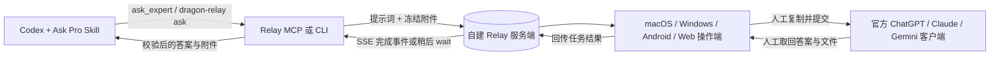

# oracle-relay 🧿 — 人工中继版 Oracle

[English](README.md) | 简体中文

`oracle-relay` 基于 [steipete/oracle](https://github.com/steipete/oracle) 修改，采用 MIT 许可证。这个分支的核心目标是：保留 Oracle 整理提示词、筛选文件、保存会话和恢复结果的能力，同时把官方 AI 网页中的提交与取回答案改成人工操作，降低浏览器自动化触发风控、账号限制或封禁的可能性。

这只是降低风险，不保证账号永远不会被限制。操作人员仍需遵守 ChatGPT、Claude、Gemini 等服务的条款与安全要求。

## 工作原理



Relay 服务端只是一个持久化任务邮箱，不是 AI 代理。它不会登录模型网站、点击浏览器或调用模型 API。生产端和操作端使用不同 token；服务端负责保存任务、附件、状态与人工回传结果。

## 包含的修改

- `dragon-relay`：异步发布任务，并通过一次 `wait` 恢复结果；
- `dragon-relay-mcp`：只暴露阻塞式 `ask_expert` 和 `await_expert`；
- macOS、Windows、Android 和 Web 人工操作端；
- Web 与原生操作端均支持跟随系统、简体中文和 English，并从同一 JSON 目录生成；
- 可续传、带 SHA-256 校验的请求/响应附件；
- MCP 同机返回附件的任务级 loopback 快速通道，失败时自动回退公网 Relay；
- `ask-pro`、`ask-pro-repomix`、`ask-pro-zip` 三个 Codex Skills；
- GitLab CI/CD、容器镜像、带 `oracle-relay-` 前缀的客户端/Skill 构建产物；
- 服务端 Docker Compose、Nginx SSE/上传模板和安全检查。

## 环境要求

- Node.js 24+
- pnpm 10（建议通过 Corepack）
- 自建服务端：Linux、Docker Compose、持久化磁盘、HTTPS 域名/反向代理
- 原生客户端按需安装对应工具链：Swift、.NET 10 或 Android SDK 36

## 安装 CLI 与 MCP

```bash
git clone https://github.com/DragonFSKY/oracle-relay.git
cd oracle-relay
corepack enable
pnpm install --frozen-lockfile
pnpm build
pnpm link --global

oracle --version
dragon-relay --help
dragon-relay-mcp --help
```

在进程环境或本机秘密存储中配置生产端连接信息，不要把真实 token 写进仓库、`AGENTS.md`、提交记录或聊天：

```bash
export ORACLE_RELAY_URL="https://relay.example.com"
export ORACLE_RELAY_TOKEN="<producer-token>"
codex mcp add dragon_relay -- "$(command -v dragon-relay-mcp)"
```

## 安装 3 个 Codex Skills

```bash
mkdir -p ~/.codex/skills/ask-pro ~/.codex/skills/ask-pro-repomix ~/.codex/skills/ask-pro-zip
cp -R skills/ask-pro/. ~/.codex/skills/ask-pro/
cp -R skills/ask-pro-repomix/. ~/.codex/skills/ask-pro-repomix/
cp -R skills/ask-pro-zip/. ~/.codex/skills/ask-pro-zip/
```

重启 Codex 后：

- 说 `askpro`、`ask pro`、`ask Oracle` 或 `问 Oracle`，由路由 Skill 自动选择打包方式；
- 纯代码、架构、Bug、代码审查使用 `ask-pro-repomix`；
- 原始文件、图片、PDF、二进制、fixture、ZIP 或精确目录结构使用 `ask-pro-zip`。

Skill 优先调用长阻塞 Relay MCP。只有 MCP 在创建任务前不可用时，才先执行 dry-run，再提交唯一一次异步 CLI 任务；后续始终恢复原 request ID，不重复创建任务。

## 自建 Relay 服务端

先生成两个不同的随机 token，然后只保存在服务器本机：

```bash
sudo install -d -m 700 /etc/oracle-relay
sudo install -d -o 1000 -g 1000 -m 700 /var/lib/oracle-relay
sudoedit /etc/oracle-relay/relay.env
sudo chmod 600 /etc/oracle-relay/relay.env
```

参考 [deploy/relay/relay.env.example](deploy/relay/relay.env.example) 填写：

```dotenv
ORACLE_RELAY_PRODUCER_TOKEN=<随机生产端-token>
ORACLE_RELAY_OPERATOR_TOKEN=<另一个随机操作端-token>
ORACLE_RELAY_HOST=0.0.0.0
ORACLE_RELAY_PORT=19476
ORACLE_RELAY_DATA_DIR=/data
ORACLE_RELAY_MAX_BODY_BYTES=268435456
ORACLE_RELAY_MAX_ATTACHMENT_BYTES=0
ORACLE_RELAY_MAX_TASK_BYTES=0
ORACLE_RELAY_TERMINAL_RETENTION_MS=86400000
```

构建并启动：

```bash
pnpm install --frozen-lockfile
pnpm build
docker compose -f deploy/relay/compose.yaml build relay
docker compose -f deploy/relay/compose.yaml up -d relay
docker compose -f deploy/relay/compose.yaml ps relay
curl -fsS http://127.0.0.1:19476/health
```

Compose 默认只监听 `127.0.0.1:19476`。必须通过 Nginx/Caddy 等提供 HTTPS，不要把 Node 端口直接暴露到互联网。Nginx 可参考 [deploy/relay/nginx-location.conf.example](deploy/relay/nginx-location.conf.example)：上传保持 request buffering，SSE 禁用 response buffering，并设置足够长的读超时。

任务和附件保存在 `/var/lib/oracle-relay`。Relay 主机能读取未加密的提示词和文件，目前协议不提供端到端加密；请使用可信服务器、磁盘加密、备份和明确的数据保留策略。

## 人工操作端

Web 操作端直接打开 Relay HTTPS 地址并输入 operator token。原生客户端的构建方式见 [docs/relay.md](docs/relay.md)：

- macOS：构建时从 `ORACLE_RELAY_OPERATOR_URL` / `ORACLE_RELAY_OPERATOR_TOKEN` 写入本机 app bundle；
- Windows：运行时从当前用户环境读取同名变量；
- Android：构建时从环境变量写入本机 APK。

仓库和普通 CI 产物不包含生产 token。不要把带凭据的本地 app/APK 当作公开附件分发。

## GitLab CI/CD

`.gitlab-ci.yml` 会：

1. 执行秘密扫描、格式、类型、lint、完整测试和 Node build；
2. 打包 3 个 Skills；
3. 构建 GitLab Container Registry 的 commit/branch 镜像；
4. 生成 `oracle-relay-*` Windows、Android 和可选 macOS 产物；
5. 在 `main` 或 tag 上提供串行的手动生产部署。

部署变量、SSH file variables 和服务器准备步骤见英文主 README 的 **GitLab CI/CD** 小节。`main` 应设为 protected branch，生产变量设为 protected/masked，部署保持手动。

`build:relay-image` 使用 Docker-in-Docker；自管 GitLab Runner 需要允许 Docker service（通常是 privileged Docker executor）。不允许 privileged 时，应替换为 rootless BuildKit/Kaniko，并保留相同的不可变镜像标签与 dotenv 产物接口。

## 升级与卸载

升级源码版：

```bash
git switch main
git pull --ff-only
pnpm install --frozen-lockfile
pnpm build
pnpm link --global
```

服务端升级前备份 `/var/lib/oracle-relay`，再构建/拉取新镜像并运行 `docker compose up -d --no-build relay`。需要回滚时改回上一个不可变 commit 镜像。

卸载全局 CLI 使用 `pnpm unlink --global @dragonfsky/oracle-relay`。Skills 可从 `~/.codex/skills/` 删除对应三个目录；服务端数据只有在确认不再需要任务和附件后再单独删除。

## 常见问题

- MCP 找不到：确认 `command -v dragon-relay-mcp` 有输出，重启 Codex，并检查 MCP 的长工具超时。
- 任务重复：始终复用第一次返回的 request ID，不要在 MCP/CLI 之间重新提交。
- SSE 中断：使用 `await_expert` 恢复同一 ID；CLI 后备只执行一次 `dragon-relay wait <id>`。
- 操作端 401：确认使用 operator token；Codex/CLI 使用 producer token，两者不能混用。
- 上传卡住：检查反向代理 body size、request buffering、SSE buffering 和超时配置。
- 客户端提示缺配置：按 [docs/relay.md](docs/relay.md) 用本机环境变量重新构建或安装。

## 安全、贡献与许可

- 安全问题请先阅读 [SECURITY.md](SECURITY.md)，不要在公开 Issue 粘贴 token、Cookie、私有提示词或附件。
- 贡献流程和本地验证命令见 [CONTRIBUTING.md](CONTRIBUTING.md)。
- 完整变更历史见 [CHANGELOG.md](CHANGELOG.md)。
- 项目使用 [MIT License](LICENSE)，并保留上游版权声明。
